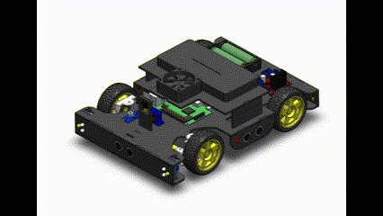

# 🚗 ADAS Robotic Vehicle Prototype – Embedded, Vision, and Control Systems

This project is a fully integrated **Advanced Driver Assistance System (ADAS)** prototype with mechanical steering, embedded control, and computer vision. It simulates real-world ADAS features using a combination of **ESP32**, **Raspberry Pi 4**, **FreeRTOS**, and **YOLOv8**, with an integrated SolidWorks mechanical design.

---

## 🧠 Key ADAS Features

| Feature  | Description                                                           |
|----------|-----------------------------------------------------------------------|
| **AEB**  | Autonomous Emergency Braking using front ultrasonic sensor            |
| **ACC**  | Adaptive Cruise Control with automatic speed regulation               |
| **LKA**  | Lane Keeping Assist with dual IR sensors and servo steering           |
| **TSDR** | Traffic Sign Detection & Recognition via Raspberry Pi + OpenCV + YOLO |
| **BSW**  | Blind Spot Warning using side-mounted ultrasonic sensors              |
| **ALS**  | Adaptive Light System with ambient light sensing and LED control      |

---

## ⚙️ System Overview

- **Main Controller:** ESP32 (C++, Arduino IDE)
- **Vision Controller:** Raspberry Pi 4 (Python, OpenCV, YOLO)
- **Communication:** I2C (ESP32 ↔ RPi), UART (ESP32 ↔ Bluetooth)
- **Power:** 2x 18650 Li-ion batteries + 5V 3A RPi power bank

---

## 🛠 Technologies Used

- **Embedded:** ESP32, FreeRTOS
- **Computer Vision:** Raspberry Pi 4, OpenCV, YOLOv8
- **Communication:** I2C, UART (Bluetooth)
- **Mechanical CAD:** SolidWorks 2020
- **Simulation:** Manual testing + real-time behavior demos

---

## 🧰 Bill of Materials (BOM)

View full BOM [here](Docs/BOM.md) or summarized below:

- **Microcontrollers:** ESP32, Raspberry Pi 4
- **Actuators:** 2x DC TT motors, 1x SG90 servo
- **Sensors:** 3x Ultrasonic (HC-SR04), 2x IR, 1x LDR
- **Camera:** Raspberry Pi Camera V1.3
- **Power:** 2x 18650 Li-ion, 1x 5V 3A Power Bank
- **Indicators:** Red, Yellow, and White LEDs for brake, hazard, and headlights

---

## 🧑‍💻 Code Repositories

### 🟦 ESP32 – Embedded Control
📁 [`ESP32_Code/`](ESP32_Code/ESP32_Code.ino)

Implements:
- Manual control via Bluetooth
- AEB, ACC, LKA, BSW, ALS
- Real-time task scheduling with FreeRTOS

## 📚 ESP32 Firmware Dependencies

The following libraries are used in the ESP32 embedded firmware. Make sure they are installed in your Arduino IDE before uploading:

| Library               | Use Case                                |
|------------------------|------------------------------------------|
| `Arduino.h`            | Core Arduino functions                   |
| `freertos/FreeRTOS.h`  | FreeRTOS base for real-time operations   |
| `freertos/task.h`      | Task creation and management in FreeRTOS |
| `BluetoothSerial.h`    | Bluetooth communication with mobile app  |
| `ESP32Servo.h`         | Servo control for front wheel steering   |
| `Wire.h`               | I2C communication with Raspberry Pi      |

> 💡 Tip: Most libraries are preinstalled with ESP32 board support in Arduino. If not, install via **Library Manager** (Sketch → Include Library → Manage Libraries).


### 🟨 Raspberry Pi – Computer Vision
📁 [`RaspberryPi_Code/`](RaspberryPi_Code/TSDR.py)

Implements:
- YOLOv8-based TSDR (Traffic Sign Detection and Recognition)
- Python script
- I2C master communication to send detection data to ESP32

## 🧠 Raspberry Pi – TSDR Python Dependencies

The Traffic Sign Detection and Recognition (TSDR) module is written in Python and uses the following libraries:

| Library             | Description                                                                 |
|----------------------|-----------------------------------------------------------------------------|
| `cv2` (OpenCV)       | Core library for image processing and visualization                        |
| `picamera2`          | Captures real-time video from the Raspberry Pi Camera                      |
| `ultralytics`        | Runs YOLOv8 model for real-time traffic sign detection and classification  |
| `cvzone`             | Simplifies display of bounding boxes, FPS counter, etc.                    |
| `pandas`             | (Optional) Used for handling datasets or logging predictions               |
| `numpy`              | Numerical operations and array handling for image data                     |
| `smbus2`             | I2C communication between Raspberry Pi and ESP32                           |
| `time` (built-in)    | Delay functions, timeouts, and logging                                     |

> 🛠️ To install manually:
> ```bash
> pip install opencv-python picamera2 ultralytics cvzone pandas numpy smbus2
> ```

---

## 🛠️ Mechanical Design

📁 [`SolidWorks_Model/`](SolidWorks_Model/)

- Full CAD of the 4-wheel chassis
- Steering and motor integration
- Rendered previews available in [`renders/`](SolidWorks_Model/renders/)


---

## 🎥 Demo



> 💡 Want to see specific features in action? [Add links to YouTube or external videos if needed]

---

## 🧭 System Architecture


---

